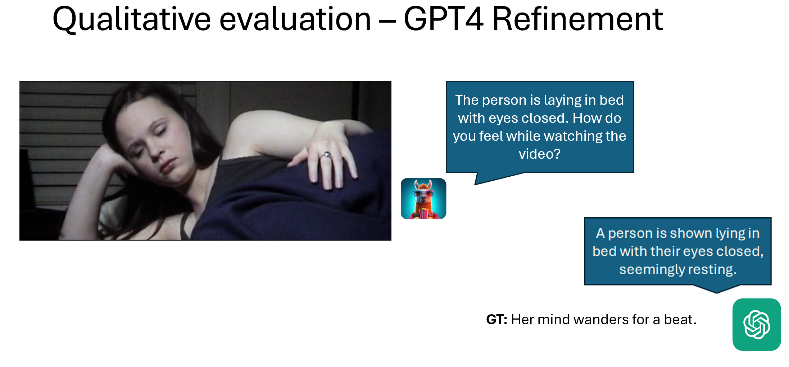

This work is inherit from [Video-Llama](https://github.com/DAMO-NLP-SG/Video-LLaMA)

## Video-Llama Pre-trained & Fine-tuned Checkpoints

The following checkpoints are the full weights (visual encoder + audio encoder + Q-Formers + language decoder) to launch Video-LLaMA. Please download these checkpoints to the folder ckpt. 


| Checkpoint       | Link | Note |
|:------------------|-------------|-------------|
| Video-LLaMA-2-7B-Pretrained    | [link](https://huggingface.co/DAMO-NLP-SG/Video-LLaMA-2-13B-Finetuned/tree/main)       | Pre-trained on WebVid (2.5M video-caption pairs) and LLaVA-CC3M (595k image-caption pairs) |
| Video-LLaMA-2-7B-Finetuned | [link](https://huggingface.co/DAMO-NLP-SG/Video-LLaMA-2-7B-Finetuned/tree/main) | Fine-tuned on the instruction-tuning data from [MiniGPT-4](https://github.com/Vision-CAIR/MiniGPT-4), [LLaVA](https://github.com/haotian-liu/LLaVA) and [VideoChat](https://github.com/OpenGVLab/Ask-Anything)|
| Video-LLaMA-2-13B-Pretrained    | [link](https://huggingface.co/DAMO-NLP-SG/Video-LLaMA-2-13B-Pretrained/tree/main)       | Pre-trained on WebVid (2.5M video-caption pairs) and LLaVA-CC3M (595k image-caption pairs) |
| Video-LLaMA-2-13B-Finetuned | [link](https://huggingface.co/DAMO-NLP-SG/Video-LLaMA-2-13B-Finetuned/tree/main) | Fine-tuned on the instruction-tuning data from [MiniGPT-4](https://github.com/Vision-CAIR/MiniGPT-4), [LLaVA](https://github.com/haotian-liu/LLaVA) and [VideoChat](https://github.com/OpenGVLab/Ask-Anything)|

## Accessing the MAD Dataset

Please contact the MAD team to access their dataset. You need to fill a form from [MAD Repo](https://github.com/Soldelli/MAD)

## Run the Inference for different stage
```
python inference_stage1.py
```

## Run the evaluation for different stage
```
python gpt_refine.py
```

## Quanlitative Result
<p align="center" width="100%">
<a target="_blank"></a>
</p>
